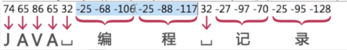

 1.String的equals方法:
   在Object类型中,equals()相当于==,比较的是地址,是否为同一对象;
 String类对equals()方法进行了重写,比较的是所指向的对象的内容是否相等.
 2.关于字符串与字节数组转换过程中使用字符编码的问题
   数据在进行传输时是以二进制的格式进行的,所以会用到将字符串转换完字节数组的内容,
 而在转换的时候,可以指定编码格式;
   这里先说一下字节:
   字节用byte类型表示,1个字节是8个二进制位,byte类型表示的范围是-128~127之间的整数.
   从字符串与byte数组间相互转换的例题可以看出,如果编码是GBK格式,则2个byte类型的数据
   表示一个汉字,如果编码是utf-8格式,则3个byte类型的数据表示一个汉字.而字母和空格还是
   用一个字节表示.如图.
   
 